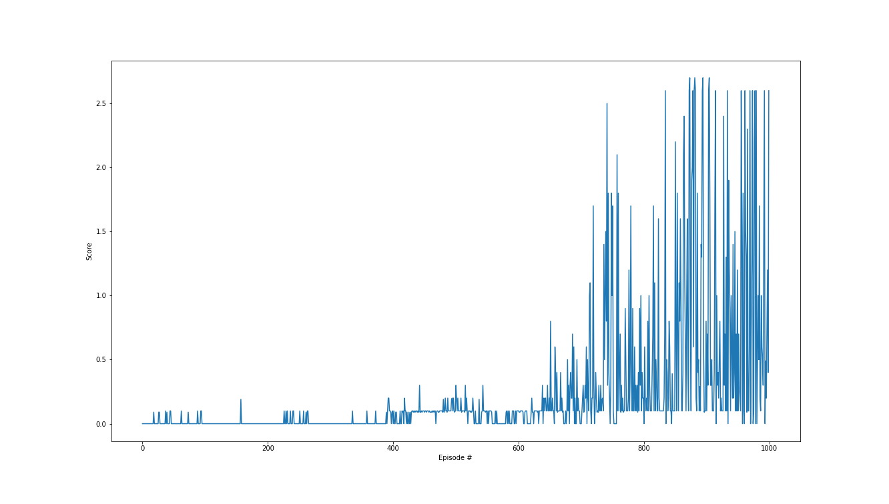

## Environment and Agent

The first step is to load the environment built on unity. Then we extract 'brain' information, which is the responsible of taking action in the enviroment.

The observation space consists of 33 variables corresponding to position, rotation, velocity, and angular velocities of the arm. Each action is a vector with four numbers, corresponding to torque applicable to two joints. Every entry in the action vector should be a number between -1 and 1.

The first step brefore to train our agent is to reset the environment, namely placing it in a random (or initial) point in its available space. The final goal for the agent will be to control a bounce to not let the ball fall on the ground, or to hit before it gets outside the box. Hitting the ball result on a rewards of +0.1 while if the ball falls off it return a reward of -0.1.

The environment will be considered solved if the agent will collect at least an average overall reaward &ge;.5 along 100 episode.

## Agent training
In our analysis is mandatory to recall that the choice of our core algorithm, namely Twin Delayed DDPG, is, as the name suggest an evolution of the DDPG algorithm. The latter suffers of overestimation issues for the **Q**-value function, and consequently our algorithm will follow the same fate.
This time however this algorithm has also been setupped in a multi agent framework. To do so the idea is to concatenate the observation of both agents to train a single a double size Twin Actor Critic model combining together the information of both the agents.

To overcome typical DDPG issues some trick has been adopted.
While explaining them however it is interesting also to explain a bit more in details the learning algorithm.

### Learning Algorithm
Twin Delayed Deep Deterministic Policy Gradient (TD3) is a RL algorithm for continuous control algorithm. It aims to improve the classical DDPG algorithm with 3 main variations:

1. Double **Q**-network: To improve action value overestimation the critic model exploit 2 different network and use the minimun value to compute the Q value target: $Q_{target} = min_{i=1,2}Q_{\theta_i'}(s', clip(\pi_{\pi'}(s')+\epsilon), a_{low}, a_{high})$ where $\epsilon$ is an additive noise used to induce exploration of the action.

2. In order to avoid the policy variance the actor training is delayed with respect the critic. This allow to collect a bit more experience under the same policy helping to reduce the variance.

3. Exploration Noise: As said in point $1.$ at the policy target an additive noise is added. This noise, clipped according to action range allowed, help the network to not get stucked in earlier suboptimal policy.

The weigths update is based on the loss computation among the current Q estimated and the Q target, updating consequently the network according to the gradient descent:

$\theta_i \leftarrow \theta_i - \alpha \nabla_{\theta_i}(1/N)\sum(Q_{\theta_i}(s, a)-Q_{target})^2$ 

On the other hand the policy is updated less frequenlty under the law:

$\phi \leftarrow \phi + \beta \nabla_{\phi}(1/N)\sum(Q_{\theta_1}(s, \pi_phi(s)))$.

Clearly $\alpha$, and $\beta$ are the respective learning rate and $N$ is the batch size.

In terms of implementation, TD3 requires the training of three neural networks: two Q networks (critic) and one policy network (actor). The Q networks are updated to minimize the difference between the current Q value and the target Q value, which is computed using the target policy and the minimum of the two target Q networks. The policy network is updated to maximize the Q value produced by one of the Q networks. The target networks are copies of the main networks but are updated with a much smaller step to ensure that the targets change slowly, enhancing the stability of learning.

#### Other Hyperparameters

1. **Double Q-Network Coefficent**: As previously state $\tau$ is the responsible on tuning the DDQN approach. For this experiment we set the values fixed to $\tau=5 \times 10^{-3}$.
2. **Learning Rate**: In the TD3's neurals networks, the learning rate (LR) determines the step size taken towards minimizing the losses during each update. It has been chosen fixed to $1 \times 10^{-3}$ for this training process, however it might be interesting to implement a scheduler to see how it will change the training in long horizon.
3. **Discount Factor**: The discount factor $ \gamma $, set at 0.95, influences how the DQN values future rewards in comparison to immediate ones. A value closer to 1 means the agent gives substantial importance to long-term rewards, ensuring that it's motivated to make decisions beneficial in the long run. This fit our case since the majority of the action are not supposed to return a positive reward or just only a reward different from 0.

### Observed Result

MATD3 algorithm seems to fit perfectly the scope of this task. It was indeed required to get an average score of at least 0.5 over the last 100 episode. The algorithm reach that goal in about 873. In addition, letting running the training for additional episode translated in an continuously improving agent, meaning that it was perfectly able to understand the environment and to find an effective policy.

Here it has showed a plot with the score per episode among the first 1000 trials.

In conclusion we tested the trained agent and observed that on average it was able to obtain an average reward of $0.94$!

### Future Implementation

As a future work it is strongly suggested to try to implement the learning algorithm for multiple agent working in parallel. This, hopefully, should to improve the convergence speed of the agent and also the robustness.

Since we have implemented a simple experience replay it also might be interesting to introduce a prioritized ER. This should also help to reach a faster convergence and to focus more onimproving worst action. A skeleton of the buffer has already been implemented, however some investigation are required likely in the priority function.

Another interesting step further is to explore multi step bootstrap as TD-N [arXiv](https://arxiv.org/abs/1611.02247), [arXiv](https://arxiv.org/abs/1602.01783).